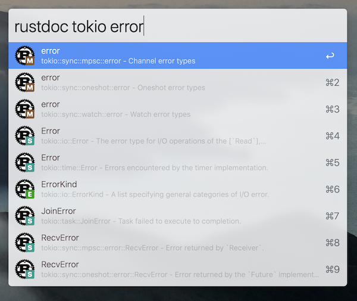

Alfred-rustdoc
==============

An Alfred workflow for searching Rust crate documentations on docs.rs. It uses
the search index file built during `cargo doc` to generate typeahead list in
Alfred, and it opens docs.rs for you.

It supports the same query syntax in `cargo-doc`. For example, you can use `fn:`
to priortize functions in the search result, or use `vec -> usize` to search all
the functions that accepts a `Vec` as parameter and returns an `usize`. For
details, please read the "search tricks" section from `cargo doc` (press "h" in any documentation generated by `cargo doc`):

> Prefix searches with a type followed by a colon (e.g., fn:) to restrict the search to a given type.
> 
> Accepted types are: fn, mod, struct, enum, trait, type, macro, and const.
> 
> Search functions by type signature (e.g., vec -> usize or * -> vec)
> 
> Search multiple things at once by splitting your query with comma (e.g., str,u8 or String,struct:Vec,test)
> 
> You can look for items with an exact name by putting double quotes around your request: "string"
> 
> Look for items inside another one by searching for a path: vec::Vec

Details
=======

This project directly uses the
[`initSearch`](https://github.com/rust-lang/rust/blob/master/src/librustdoc/html/static/main.js#L528)
function in [rust-lang/rust](https://github.com/rust-lang/rust) (hence written in NodeJS) with some stubs to make
it work outside the browser. Then it fetches the `search-index.js` file
generated during the documentation building process (`cargo doc`) from docs.rs
to serve the search result in Alfred. **The search-index.js is evaluated inside a sandbox provided by [vm2](https://github.com/patriksimek/vm2). This means this workflow will be running code downloaded from the Internet inside a sandbox.** This is really unfortunate since some big crates rely on some JavaScript features to do compression (for example, [this search index file](view-source:https://docs.rs/nom/5.0.1/search-index-20190820-1.39.0-nightly-bea0372a1.js)). Please let me know if there is an alternative way to acquire the search index without actually executing any remote code.

License
=======

MIT